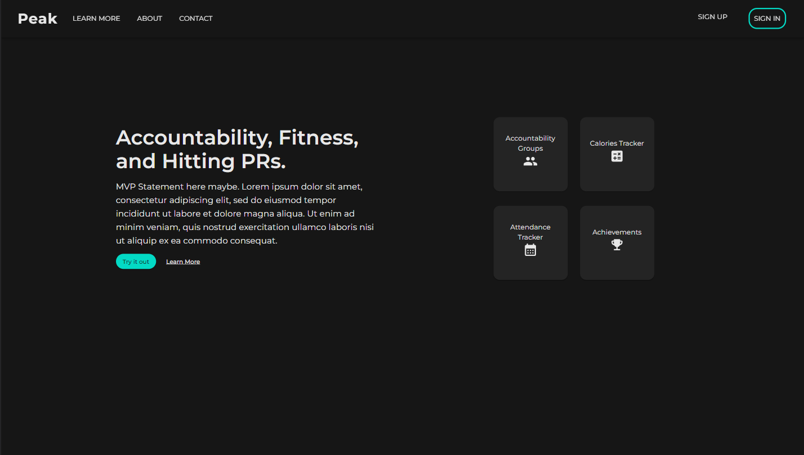
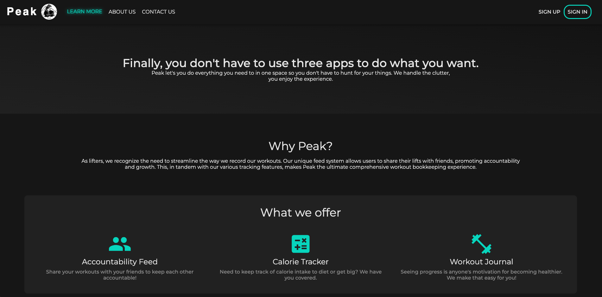
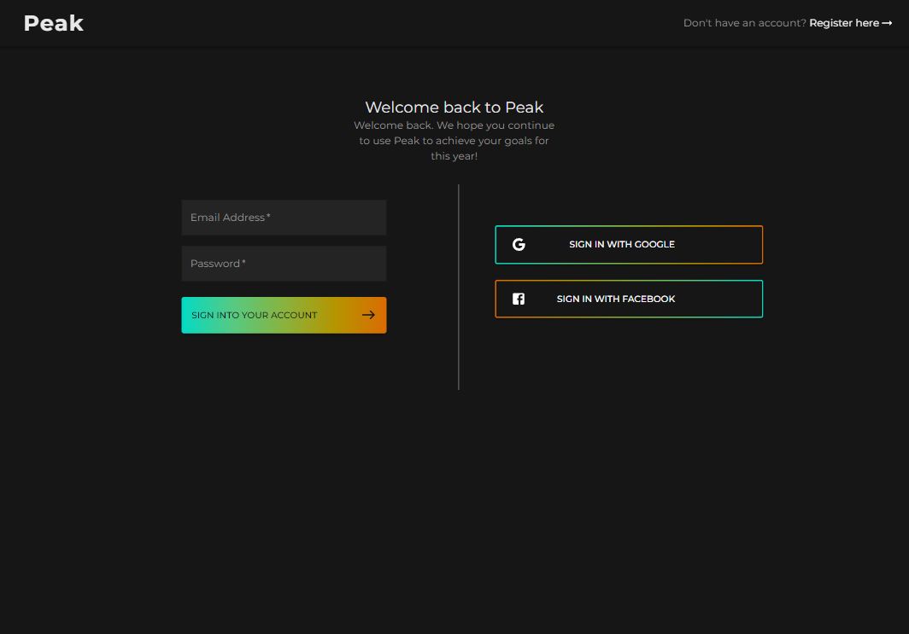

# Peak 

[Features](#features) •
[Screenshots](#screenshots) •
[Technology](#technology) •
[Packages](#packages) •
[Contributors](#contributors)

## Features

Peak is a health tracking website that strives to bring users closer to their fitness goals with a long-term mindset.

- Keep track of when you've gone to the gym with the attendance tracker. Visually tracks when you've uploaded a workout to the app and keeps track of your streaks.
- Workout journal to keep track of your workouts (exercise, sets, reps) for the entire year.
- Calculate your calories through our tracker that lets you input custom meals for breakfast, lunch, and dinner.
- Find motivation through accountability groups, where anyone can join up with friends and have their workouts automatically sent to the group.
- Gain achievements through challenges to push motivation and show off by displaying them on your personal profile.

## Screenshots

<h3 align="center">Landing Page<h3>

    

<h3 align="center">Learn More Page<h3>

    

<h3 align="center">Sign-in Page<h3>

    

## Technology

| Tech Name  | Home Page               |
| ---------- | ----------------------- |
| Next       | <https://nextjs.org/>   |
| React      | <https://reactjs.org/>  |
| MaterialUI | <https://mui.com/>      |
| Supabase   | <https://supabase.com/> |

## Packages

| Package Name      | Home Page                        |
| ----------------- | -------------------------------- |
| Recharts          | <https://recharts.org/en-US/>    |
| react-toastify    | <https://reactjs.org/>           |
| dayjs             | <https://day.js.org/>            |
| styled-components | <https://styled-components.com/> |

## Contributors

| Name         | Github                                    | LinkedIn                              |
| ------------ | ----------------------------------------- | ------------------------------------- |
| Sean Brown   | [Github](https://github.com/sbrown5757)   | [LinkedIn](https://www.linkedin.com/) |
| Warren Chan  | [Github](https://github.com/warrenchan13) | [LinkedIn](https://www.linkedin.com/) |
| Bryan Olivo  | [Github](https://github.com/olivob)       | [LinkedIn](https://www.linkedin.com/) |
| Jahed Prince | [Github](https://github.com/jahedprince)  | [LinkedIn](https://www.linkedin.com/) |
| Justin Suh   | [Github](https://github.com/justindjsuh)  | [LinkedIn](https://www.linkedin.com/) |
